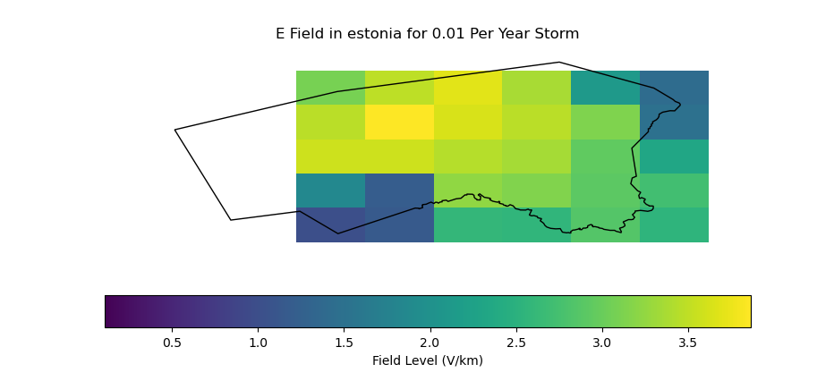
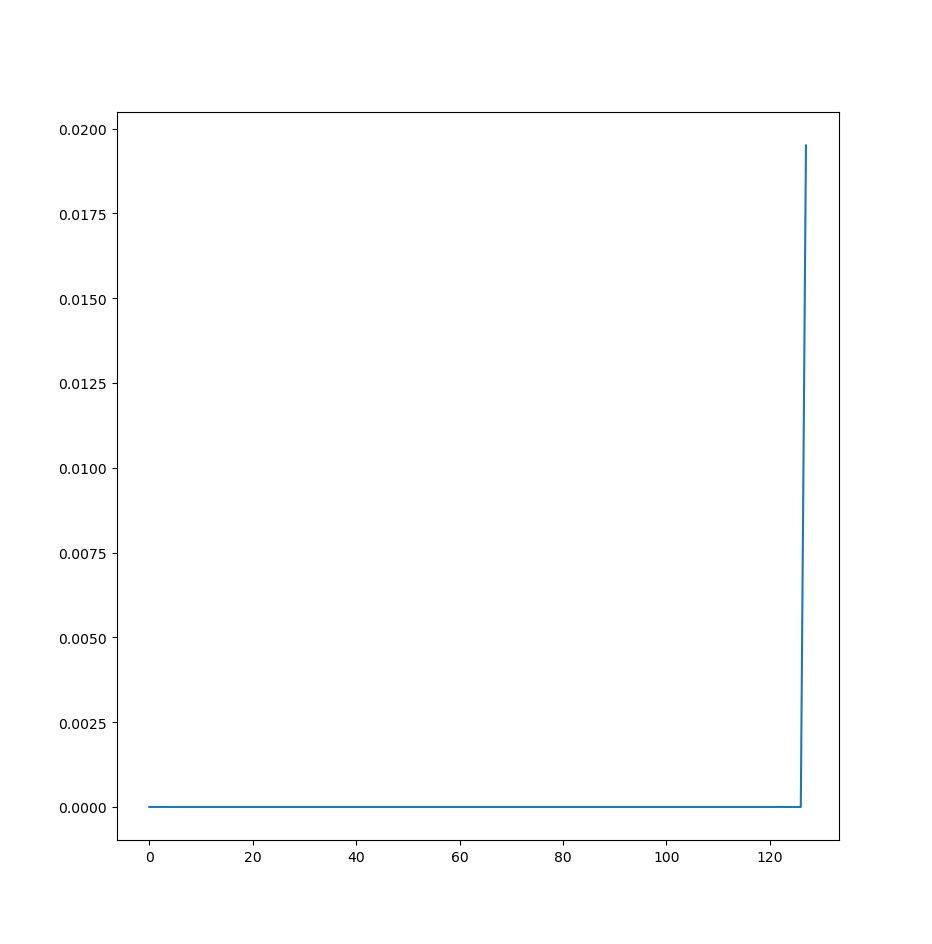

### Errors
Full log in ```output.txt```. There is a lot to digest there, I focus here on what stood out to me.

```
Unable to locate module for: TransformerWinding (587b5942-24e0-11e9-9720-02ba7def0216)

Referenced 'SubGeographicalRegion' [] object missing.

Missing 'TransformerWinding' object with uuid: 587b5942-24e0-11e9-9720-02ba7def0216

Referenced 'Terminal' [587b5942-24e0-11e9-9720-02ba7def0216] object missing.
```

I'm guessing these errors are due to what is mentioned in these comments in Network.py:

```
# NOTE: unfortunately PyCIM does not appear to import the Transformerwinding object, so I had to hack together my own import function for this property.
```
```
# NOTE: again because of the bug with PyCIM, am hacking together a reference by using the names of the AC power lines, rather than the TransformerWinding(A) - Terminal - ConnectivityNode - Terminal - ACLineSegment -Terminal - ConnectivityNode - Terminal - TransformerWinding(B) UUID terminal chain from the cim.xml.
```

Hopefully all the ```FutureWarnings``` can be ignored? (not pasted here, see full log)
### Plots
Two images were changed, here is a comparison:
https://github.com/allfed/GeomagneticModel/commit/6606bf13ee1a4714e1e7bb67bd47eb0c12e0845e

- GICs:
    - The legend I think is not displaying correctly; I'm guessing the size of a point/circle is supposed to be proportional to the GIC strength, in which case the new values are smaller. Why is that?
    - Poly looks a bit strange to me, but I don't have experience with those datasets, does it look fine?
- Grid:
    - Aside from an odd switch of colours, the grids differ slightly, I'm guessing this is due to me using an older data set (from OpenGridMap instead of transnet_allfed as the latter does not have datasets available)

Unsaved Figures, shown during runtime (is there a flag to change this behaviour?):

- E-field. Does this look right, how do we tell?

- Unknown. This one is unlabelled, but from looking at the code I think this is the probability of transformers to be damaged. I.e., Y-axis is probability of getting damaged, X-axis is transformer index, where indices are sorted by probability values.
